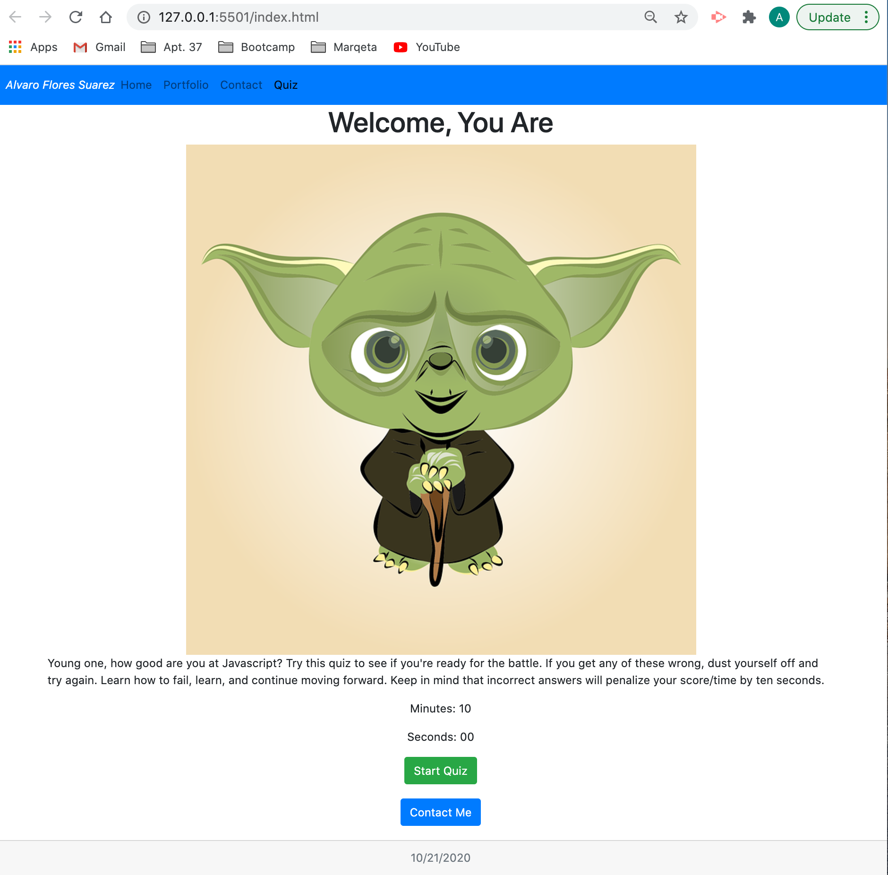

# Javascript Quiz

## Repository

This webpage is meant to challenge your javascript knowledge. I've also thrown a Yoda theme to spice things up.

On this page, you'll be put through a series of 5 different questions, while also being timed. Any time you respond incorrectly, 10 seconds are deducted from the timer... no pressure though. The galaxy only depends on you!

I've added this to my portfolio so feel free to also browse around and don't hestitate to contact me!

Below I'll include a screenshot of what the page looks like.

Click [here](https://floressuarezalvaro.github.io/javascript_quiz/) to access the quiz.

## Contributing

The best way to participate in my portfolio is to [submit a bug](https://github.com/floressuarezalvaro/javascript_quiz/issues). Additionally, you can review the [source code](https://github.com/floressuarezalvaro/javascript_quiz/pulls) changes. Lastly, you can [build from the source itself](https://github.com/floressuarezalvaro/javascript_quiz/wiki).

## MIT License

Copyright (c) [2020] [Alvaro Flores Suarez]

Permission is hereby granted, free of charge, to any person obtaining a copy
of this software and associated documentation files (the "Software"), to deal
in the Software without restriction, including without limitation the rights
to use, copy, modify, merge, publish, distribute, sublicense, and/or sell
copies of the Software, and to permit persons to whom the Software is
furnished to do so, subject to the following conditions:

The above copyright notice and this permission notice shall be included in all
copies or substantial portions of the Software.

THE SOFTWARE IS PROVIDED "AS IS", WITHOUT WARRANTY OF ANY KIND, EXPRESS OR
IMPLIED, INCLUDING BUT NOT LIMITED TO THE WARRANTIES OF MERCHANTABILITY,
FITNESS FOR A PARTICULAR PURPOSE AND NONINFRINGEMENT. IN NO EVENT SHALL THE
AUTHORS OR COPYRIGHT HOLDERS BE LIABLE FOR ANY CLAIM, DAMAGES OR OTHER
LIABILITY, WHETHER IN AN ACTION OF CONTRACT, TORT OR OTHERWISE, ARISING FROM,
OUT OF OR IN CONNECTION WITH THE SOFTWARE OR THE USE OR OTHER DEALINGS IN THE
SOFTWARE.